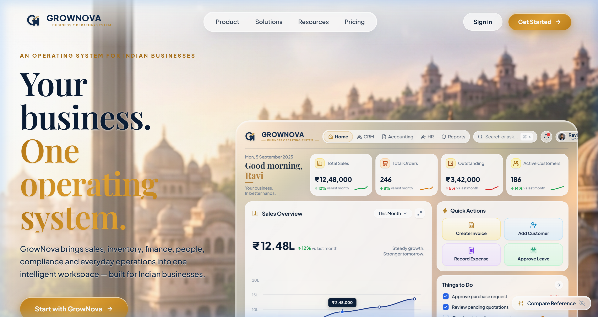
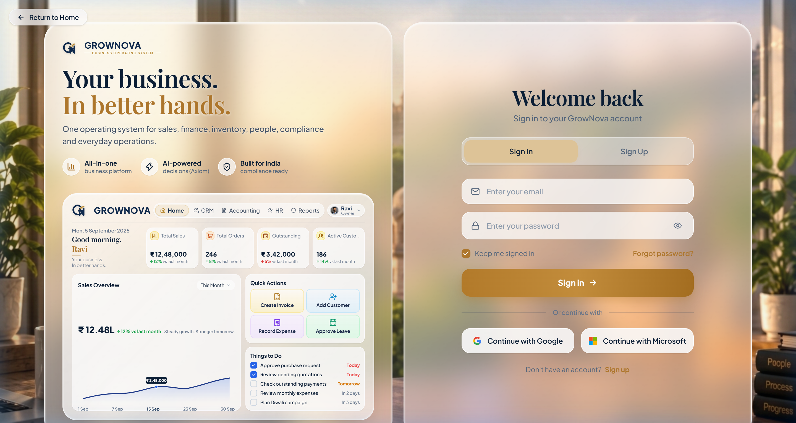

# 🌟 GrowNova — One Operating System

<div align="center">

<!-- Animated Typing SVG Header Banner -->
<a href="https://github.com/kaniskoChakraborty/Grownova-0.1">
  
</a>

<p align="center">
  <b>An AI-first, vernacular, one-tap business OS engineered for Indian enterprises, MSMEs, and entrepreneurs.</b>
  <br />
  <i>Unified sales, finance, inventory, CRM, HR, compliance, and everyday business intelligence.</i>
</p>

<!-- Technology Badges -->
<p align="center">
  
  
  
  
  
  
</p>

<p align="center">
  <a href="#-quick-start-for-anyone-non-tech-friendly">⚡ 60-Second Quick Start</a> •
  <a href="#-what-all-we-have-built-till-now">✨ What We Built</a> •
  <a href="#-visual-previews">📸 Visual Previews</a> •
  <a href="#-project-structure">📂 Project Structure</a> •
  <a href="#-faq--troubleshooting">❓ Non-Tech FAQ</a>
</p>

---

</div>

<br />

## ⚡ Quick Start for Anyone (Non-Tech Friendly)

You do **NOT** need to be a programmer or terminal expert to run GrowNova. Follow whichever option is easiest for you:

### 🚀 Option 1: The One-Click Way (Windows & Mac)

<details open>
<summary><b>Click to expand One-Click Instructions</b></summary>
<br />

1. **Prerequisite**: Make sure **Node.js** is installed on your computer. If not, download it once from [nodejs.org](https://nodejs.org/) (click the big green **LTS** button and install).
2. **On Windows**:
   - Double-click the file named **`run.bat`** in this project folder.
   - It will automatically verify packages, launch your browser, and open GrowNova at `http://localhost:5173`!
3. **On Mac or Linux**:
   - Double-click or run `./run.sh` in your terminal.
   - That's it! GrowNova opens immediately in your web browser.

</details>

---

### 💻 Option 2: The 3-Step Terminal Way

If you prefer copying and pasting 3 commands in your terminal or command prompt:

```bash
# Step 1: Clone this repository and enter the directory
git clone https://github.com/kaniskoChakraborty/Grownova-0.1.git
cd Grownova-0.1

# Step 2: Switch to the devansh branch (where the latest UI lives)
git checkout devansh

# Step 3: Run the frontend application
cd frontend
npm install
npm run dev
```

Now open your web browser and visit:
👉 **[http://localhost:5173](http://localhost:5173)**

---

### 🌐 Quick Navigation URLs

| Screen / Feature | Web URL | Description |
| :--- | :--- | :--- |
| 🏠 **Main Landing Page** | [`http://localhost:5173/`](http://localhost:5173/) | Hero presentation with 3D liquid glass visionOS dashboard |
| 🔐 **Dedicated Auth Page** | [`http://localhost:5173/auth`](http://localhost:5173/auth) | Dual glass slabs for instant Sign In & Sign Up transitions |
| 🩺 **Backend Health API** | [`http://localhost:3000/health`](http://localhost:3000/health) | NestJS system status and health verification probe |

<br />

---

## 📸 Visual Previews

### 1. Main Landing Page & Apple visionOS Liquid Glass Dashboard
*Featuring authentic frosted translucency, 3D specular rim reflections, and interactive spatial mouse tilt over the sunlit Indian heritage scene:*

<div align="center">
  
</div>

<br />

### 2. Dedicated Authentication Experience (`/auth`)
*Dual liquid glass slab architecture with live Sign In / Sign Up tab switching, high-resolution vector mini-dashboard, and enterprise Single Sign-On:*

<div align="center">
  
</div>

<br />

---

## ✨ What All We Have Built Till Now

Here is a comprehensive breakdown of everything built into the GrowNova platform:

### 💎 1. Apple visionOS Liquid Glassmorphism System
- **100% Vector Precision**: Completely eliminated low-resolution raster artifacts. All text uses true scalable web fonts (`Playfair Display` serif & `Plus Jakarta Sans`), and all icons are razor-sharp vector SVGs.
- **Authentic Glass Physics**: Engineered using multi-layer CSS:
  - Frosted liquid backdrop blur: `backdrop-filter: blur(28px) saturate(175%)`
  - 3D Bevel Highlights: Inset multi-angle specular gleams (`inset 0 2px 3px rgba(255,255,255,0.95)` and bottom base reflections).
  - Ambient Golden Rim Glow: Soft radial ambient lighting matching the golden hour sunset.
- **Spatial Mouse Parallax (Gyroscopic Tilt)**: Real-time 3D rotation (`perspective(1200px)` with subtle `rotateX` and `rotateY` response) as the user navigates their cursor across the viewport.

---

### 📊 2. Executive Command Dashboard (`VisionDashboard.tsx`)
- **Top Header Bar**:
  - Official GrowNova brand logo with interlocking gear-node icon.
  - Active navigation pill capsule: `Home` (amber active state), `CRM`, `Accounting`, `HR`, and `Reports`.
  - Global Search pill with keyboard shortcut badge: `Search or ask... ⌘ K`.
  - Notification bell with red status badge.
  - User Profile chip featuring executive portrait avatar (Ravi, Owner) and quick dropdown chevron.
- **Greeting & Live Telemetry KPIs**:
  - Editorial date stamp: `Mon, 5 September 2025`.
  - Elegant serif greeting: `Good morning, Ravi` with warm amber underline bar and subtitle `Your business. In better hands.`
  - **4 KPI Stat Cards** with customized smooth bezier sparklines:
    1. 📈 **Total Sales**: `₹ 12,48,000` (`↑ 12% vs last month` + emerald green curve)
    2. 🛒 **Total Orders**: `246` (`↑ 8% vs last month` + warm amber curve)
    3. 💳 **Outstanding**: `₹ 3,42,000` (`↑ 5% vs last month` + red alert curve)
    4. 👥 **Active Customers**: `186` (`↑ 14% vs last month` + emerald green curve)
- **Sales Overview Interactive Chart**:
  - Timeframe selector dropdown (`This Month ∨`, `Last Month`, `Q3 FY25`, `This Year`) + expand button.
  - Large metric display: `₹ 12.48L` with growth banner `Steady growth. Stronger tomorrow.`
  - Mathematical SVG area chart with sapphire wave curve and soft gradient fill.
  - Interactive glowing node at **15 Sep** with floating dark navy tooltip: `₹ 2,48,000`.
- **2×2 Quick Actions Grid**:
  - 📄 **Create Invoice**: Amber frosted card with gold document icon.
  - 👤+ **Add Customer**: Sky blue frosted card with user-plus icon.
  - 🧾 **Record Expense**: Soft lavender frosted card with receipt icon.
  - 📅 **Approve Leave**: Mint green frosted card with calendar icon.
- **Things to Do Workflow Checklist**:
  - Dynamic completion states: Click any task to toggle between completed (solid blue square with white checkmark) and pending.
  - Urgency indicators: `Today` (coral/red), `Tomorrow` (amber), `In 2 days` (gray), `In 3 days` (gray).
  - Quick action forward button `(→)`.

---

### 🔐 3. Dedicated Authentication Suite (`/auth`)
- **Direct Route**: `http://localhost:5173/auth` is completely isolated from the landing page.
- **Dual Slab Composition**: Matches the exact visual reference, rendering two vertical glass slabs standing on the mahogany executive desk.
- **Instant Client-Side Tab Switching**:
  - Seamlessly toggle between **Sign In** and **Sign Up** inside the right glass panel without page reloads.
- **Sign In View**:
  - Frosted email input with mail icon.
  - Frosted password input with lock icon and interactive `Eye` / `EyeOff` visibility toggle.
  - "Keep me signed in" checkbox + interactive "Forgot password?" reset toast notification.
  - Golden amber CTA button: `Sign in →`.
  - Enterprise Single Sign-On: Google (`Continue with Google`) and Microsoft (`Continue with Microsoft`) vector branded cards.
- **Sign Up View**:
  - Full Name, Business / Company Name, Email, Password, and Confirm Password fields.
  - Full client validation with matching password checks.
  - Golden amber CTA button: `Create account →`.
- **Left Panel Mini Dashboard Preview (`GrowNovaPreview.tsx`)**:
  - A perfectly scaled, razor-sharp vector miniature of the visionOS glass dashboard embedded directly inside the left glass slab.

---

### 👑 4. Hero Section & Typography Alignment (`HeroLeft.tsx`)
- **Flush Left Margin Alignment**: Cleanly aligned the uppercase eyebrow `AN OPERATING SYSTEM FOR INDIAN BUSINESSES`, large dual-tone headline `Your business. One operating system.`, and body paragraph.
- **Call-to-Action Buttons**:
  - `Start with GrowNova →` (warm golden gradient with glowing hover effect, routes to `/auth?mode=signup`).
  - `Explore the OS ▶` (frosted glass button with play icon).
- **Value Proposition Badges**:
  - 📊 `All-in-one business platform`
  - ⚡ `AI-powered decisions (Axiom)`
  - 🛡️ `Built for India compliance ready`

---

### ⚙️ 5. Backend Foundation (NestJS Architecture)
- **Framework**: NestJS 11 with TypeScript.
- **Configuration**: Dynamic environment variable loading (`.env`).
- **Health Verification**: Dedicated `GET /health` endpoint returning system operational status (`{"status":"ok","service":"grownova-api"}`).
- **Domain Readiness**: Architecture prepared for modular scaling (CRM, GST/Accounting, Inventory, HR/Payroll, Compliance).

<br />

---

## 📂 Project Structure

```text
Grownova-0.1/
├── run.bat                          # ⚡ 1-Click Windows Launcher (Non-Tech friendly)
├── run.sh                           # ⚡ 1-Click Mac/Linux Launcher
├── README.md                        # 📖 Animated Interactive Project Documentation
├── package.json                     # Backend configuration (NestJS)
├── src/                             # Backend source code
│   ├── main.ts                      # NestJS entry point
│   ├── app.module.ts                # Root application module
│   └── health/                      # System health check module
│       ├── health.controller.ts
│       └── health.module.ts
│
├── frontend/                        # Frontend React Application (Vite + Tailwind)
│   ├── package.json
│   ├── vite.config.ts
│   ├── index.html
│   ├── public/                      # Static assets & photography
│   │   ├── hero-bg.jpg              # Cinematic sunlit Indian heritage desk scene
│   │   ├── ravi_avatar_hq.jpg       # High-resolution executive portrait
│   │   └── reference.jpg            # Original visual source of truth
│   └── src/
│       ├── App.tsx                  # Client-side router (/ and /auth)
│       ├── pages/
│       │   ├── LandingPage.tsx      # Main landing experience
│       │   └── AuthPage.tsx         # Dedicated /auth authentication route
│       └── components/
│           ├── VisionDashboard.tsx  # 100% Vector visionOS Liquid Glass Dashboard
│           ├── HeroLeft.tsx         # Aligned marketing copy & CTAs
│           ├── GrowNovaLogo.tsx     # Official vector GrowNova brand logo
│           ├── ReferenceCompare.tsx # QA reference comparison slider
│           ├── navigation/
│           │   └── LandingNav.tsx   # Top navigation bar
│           └── auth/
│               ├── AuthShell.tsx        # Dual liquid glass slab container
│               ├── AuthTabs.tsx         # Sign In / Sign Up tab switcher
│               ├── AuthForm.tsx         # Interactive login & registration forms
│               ├── SocialLogin.tsx      # Google & Microsoft SSO tiles
│               └── GrowNovaPreview.tsx  # Vector miniature preview tablet
```

<br />

---

## 🛠️ Technology Stack

| Domain | Technology | Purpose |
| :--- | :--- | :--- |
| **Frontend Framework** | React 19 (TypeScript) | Reactive, component-driven user interface |
| **Build & Dev Tooling**| Vite 8 | Instant Hot Module Replacement (HMR) & rapid bundling |
| **Styling & CSS** | Tailwind CSS + Custom CSS | Glassmorphism tokens, backdrop filters, custom animations |
| **Iconography** | Lucide React | Clean, scalable vector SVG icons |
| **Typography** | Playfair Display & Plus Jakarta Sans | High-contrast luxury editorial serif + clean modern sans-serif |
| **Routing** | React Router v7 | Seamless client-side route navigation (`/` and `/auth`) |
| **Backend Framework** | NestJS 11 + Express | Enterprise-grade modular TypeScript API server |

<br />

---

## ❓ FAQ & Troubleshooting for Non-Tech Users

<details>
<summary><b>1. How do I stop the app when I'm done?</b></summary>
<br />
Click into the command prompt or terminal window where GrowNova is running and press <b>Ctrl + C</b> on your keyboard. Type <code>y</code> if asked to terminate the batch job.
</details>

<details>
<summary><b>2. It says "Node.js is not recognized" when I double-click run.bat</b></summary>
<br />
This means Node.js is not yet installed on your computer. Download the free, official installer from <a href="https://nodejs.org/">nodejs.org</a> (choose the LTS version). Run the installer, accept default settings, and double-click <code>run.bat</code> again.
</details>

<details>
<summary><b>3. The browser didn't open automatically</b></summary>
<br />
Simply open Google Chrome, Safari, Edge, or Firefox and manually type or click: <a href="http://localhost:5173">http://localhost:5173</a>.
</details>

<details>
<summary><b>4. How do I get the latest updates from GitHub?</b></summary>
<br />
Open terminal in the project folder and run:
<pre><code>git checkout devansh
git pull origin devansh</code></pre>
Then run <code>run.bat</code> or <code>npm run dev</code>.
</details>

<br />

---

<div align="center">

<b>GrowNova Business Operating System</b> • Built with precision for Indian enterprises.

<br />

<sub>© 2026 GrowNova Inc. All rights reserved.</sub>

</div>
